<!-- Generated by docgen (see the golf-stats repo: docgen/ + the how-to-doc skill).
     Do not edit by hand — edit docgen/sections.json + docgen/sections/*.md and
     re-run the generator. -->

# Golf Stats — How to Score

Golf Stats tracks your game **tournament by tournament, round by round, and hole
by hole** — scores, the stats that actually move your handicap, GPS shot maps,
and live sharing. This guide walks through scoring a round from start to finish.

> **Just here to watch someone's live round?** You don't need any of this — tap
> the live icon at the top of the tournament list, enter the share code they
> sent you, and you're following along. The rest of this guide is for scoring
> your own rounds.

## Contents

- [Getting started](#getting-started)
- [Tournaments](#tournaments)
  - [Create a tournament](#create-a-tournament)
  - [Edit a tournament](#edit-a-tournament)
- [Rounds](#rounds)
  - [Create a round](#create-a-round)
  - [Find a course](#find-a-course)
  - [Pick a tee](#pick-a-tee)
  - [Set the weather](#set-the-weather)
  - [Copy yardages from another round](#copy-yardages-from-another-round)
  - [Bookmark a round](#bookmark-a-round)
  - [Edit a round](#edit-a-round)
  - [Show or hide course & weather](#show-or-hide-course--weather)
- [Scoring a hole](#scoring-a-hole)
  - [The hole form](#the-hole-form)
  - [Understanding the stats](#understanding-the-stats)
- [The shot map](#the-shot-map)
  - [Tag shots, the flag & auto score](#tag-shots-the-flag--auto-score)
  - [Tap to tag vs. center crosshair](#tap-to-tag-vs-center-crosshair)
  - [Plays-like distance](#plays-like-distance)
  - [Edit a shot: penalties & relief](#edit-a-shot-penalties--relief)
- [Scoring from your Apple Watch](#scoring-from-your-apple-watch)
- [Reviewing a round](#reviewing-a-round)
  - [The scorecard](#the-scorecard)
  - [Round summary](#round-summary)
  - [Scoring & putting breakdown](#scoring--putting-breakdown)
  - [AI round analysis](#ai-round-analysis)
- [Sharing a round](#sharing-a-round)
  - [Share live scores](#share-live-scores)
  - [Follow a live round](#follow-a-live-round)
  - [Follow several players](#follow-several-players)
  - [Export or send a round](#export-or-send-a-round)

## Getting started

Golf Stats is organised in three levels: a **tournament** holds one or more
**rounds**, and each round holds its **holes**. Everything starts from the
tournament list — the home screen.

- **＋** (top right) creates a new tournament.
- The **live** icon (top right) follows someone else's round from a share code.
- The **menu** (top left) holds About, your club bag, backup & restore, and the
  strokes-gained baseline.

Tap any tournament to open its rounds and start scoring.

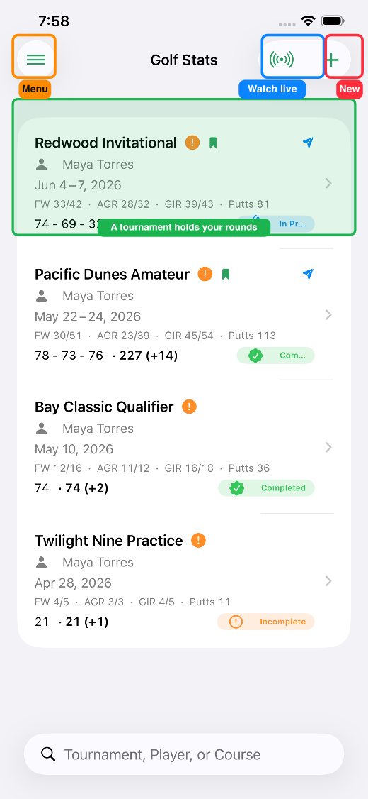

## Tournaments

A **tournament** is the top level — it groups the rounds you play in one event
(or just one casual round). Open one from the list to see its rounds.

### Create a tournament

Tap **＋** on the tournament list. Give the tournament a **name** (required) —
for example "Club Championship". Add a **player name** if you like; names you've
entered before autofill as you type. Choose the **start and end dates** and a
**status** (In Progress, Completed, or Incomplete). Tap the **checkmark** to
save, and the tournament opens ready for its first round.

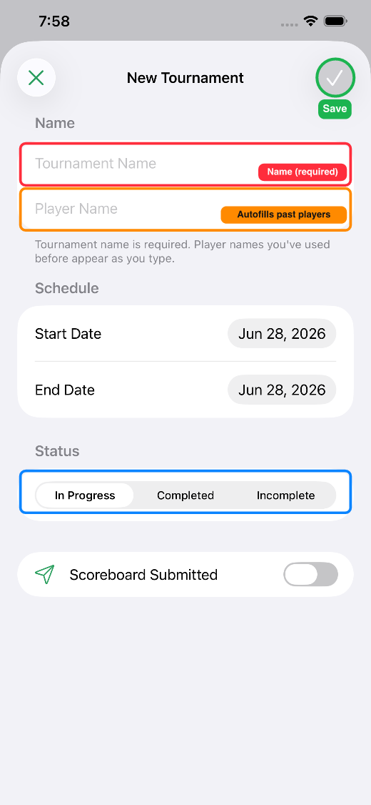

### Edit a tournament

To change a tournament's name, player, dates, or status later, open it and pick
**Edit Tournament** from the **•••** menu. Make your changes and tap the
checkmark to save.

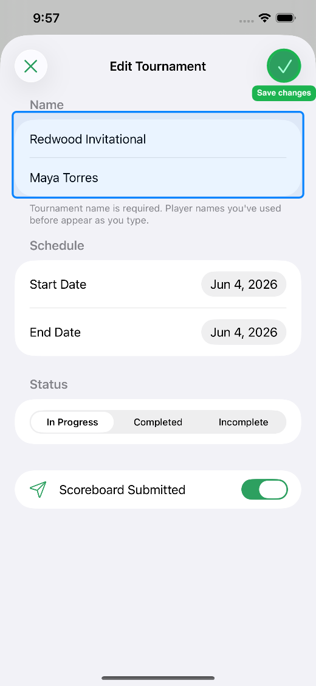

## Rounds

A **round** lives inside a tournament and holds its holes. A tournament can have
several rounds; switch between them with the tabs near the top.

### Create a round

Inside a tournament, open the **•••** menu and tap **Add Round** (or the **+** on
a new tournament). Set the **number of holes**, name the round, and optionally
add a course, a tee time, and the weather. Tap **Find Course** to search for a
real course and import its pars and yardages. Tap the checkmark to save.

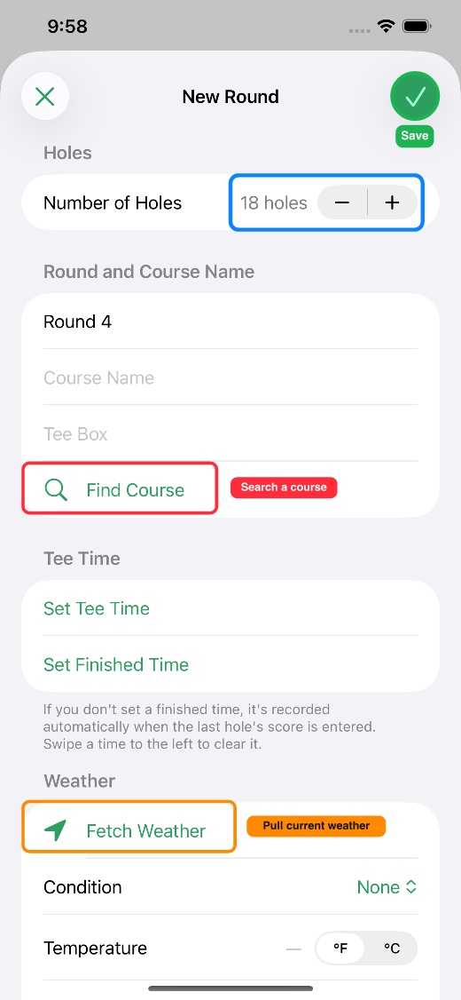

### Find a course

Tap **Find Course** in the round form to search the worldwide course database.
Type a course name, or tap **Use Current Location** to find courses near you
(only your region is sent — never your exact coordinates). Tap a course to pick
its tee.

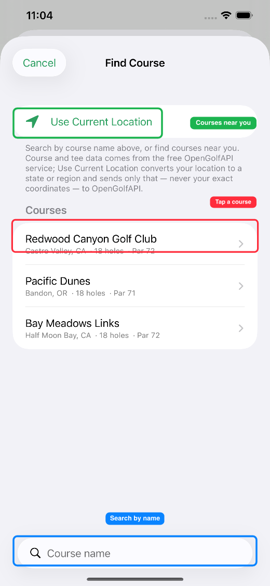

### Pick a tee

After choosing a course, pick the **tee** you're playing — each shows its colour,
total yardage, and course/slope rating. Tapping a tee imports that tee's **par,
yardage, and stroke index** into every hole, so you don't have to enter them by
hand.

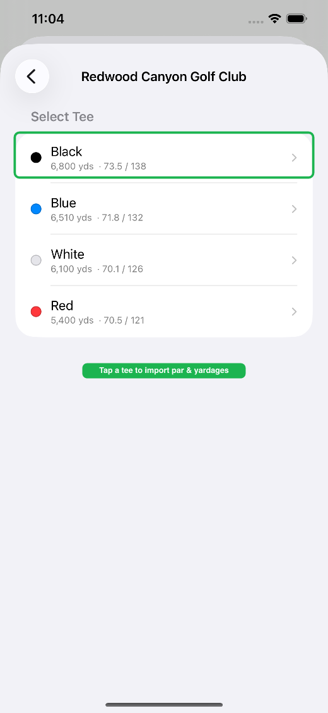

### Set the weather

Tap **Fetch Weather** in the round form to pull the current conditions for your
location automatically, or enter them by hand — condition, temperature,
humidity, wind and gust, direction, precipitation chance, UV index, and
pressure. The weather is saved with the round and shown on the course strip.

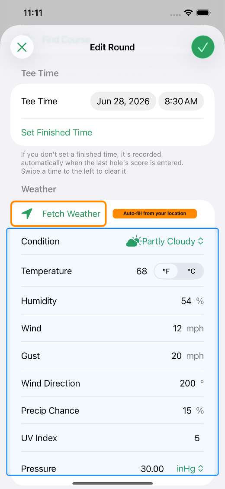

### Copy yardages from another round

Playing the same course again? Open the round's **•••** menu and tap **Add Round
with … Yardage**. It creates a new round pre-filled with that round's course,
tee, and per-hole pars and yardages — so all you enter is scores.

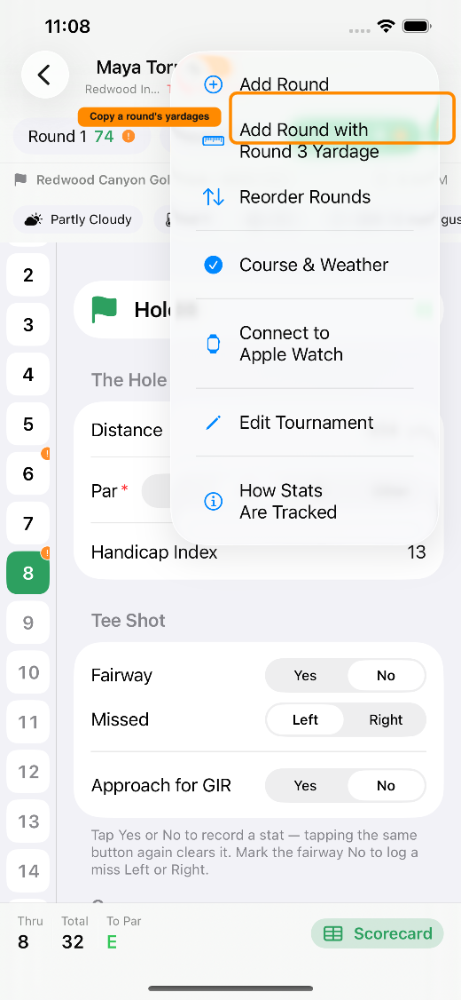

### Bookmark a round

Bookmark a round to flag it and jump back to it quickly. Long-press a round tab
and choose **Bookmark Round**; a bookmark appears on the tab (and on the
tournament in the list). On the shot map and hole view you can then swipe to the
next bookmarked round — handy for following one playing partner across rounds.

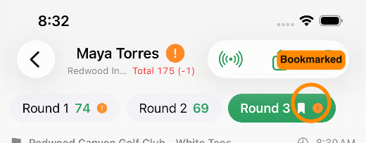

### Edit a round

Long-press a round tab and choose **Edit Round** to change its hole count,
course, tee, times, or weather. Reducing the hole count removes data for the
holes that no longer exist.

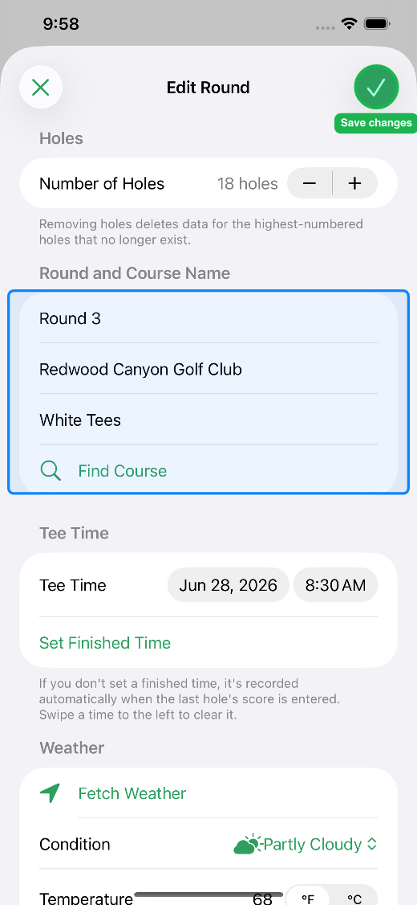

### Show or hide course & weather

The course and weather strips sit above the hole so you can see where you're
playing and the conditions. Toggle them with **Course & Weather** in the **•••**
menu — a checkmark shows when they're visible.

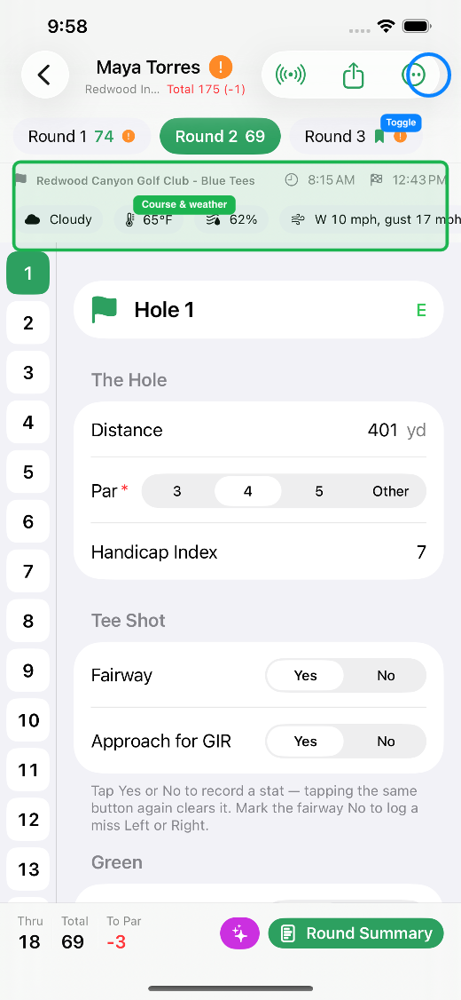

## Scoring a hole

Tap a tournament, then a round, to start scoring hole by hole.

### The hole form

Open a round and pick a hole from the list down the left side (or swipe). Each
hole is a short form, grouped into sections:

- **The Hole** — distance, par (tap **3 / 4 / 5**, or *Other* for par 6+), and
  the handicap index.
- **Tee Shot** — tap **Fairway** Yes or No (No reveals a Left/Right miss), and
  **Approach for GIR**. Tapping a Yes/No button again clears it back to blank.
- **Green** — GIR, your first-putt distance, and total putts (just below).
- **Score** — penalty strokes and the score for the hole.
- **Notes** and a **Review** flag finish it off.

Not sure what a stat means? The next section explains them all.

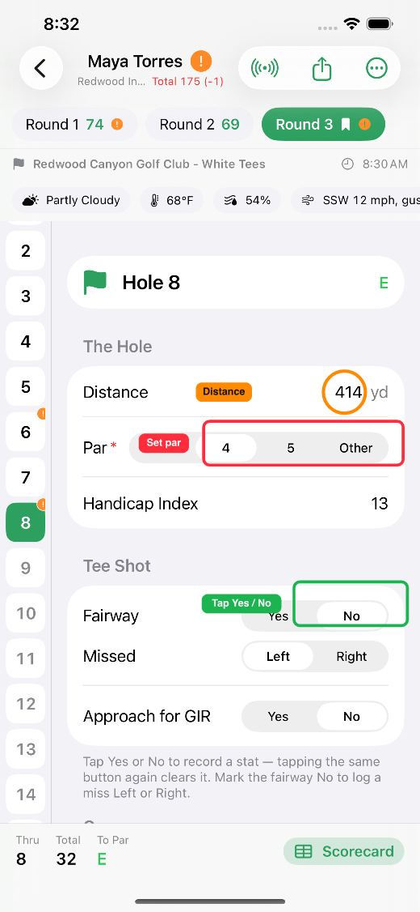

### Understanding the stats

Every tracked stat is explained in one place. Open the round's **•••** (Actions)
menu and tap **How Stats Are Tracked** — the same menu that holds Add Round and
Course & Weather.

The guide covers **Fairway**, **Approach for GIR**, **GIR**, **Strokes Gained**,
and the **Review** flag. In short, **strokes gained** compares your play to a
benchmark golfer (set under *Strokes Gained Baseline* in the menu): a positive
number means you beat the benchmark on that hole, a negative number means you
lost ground. It's calculated from your shot map, and the round summary breaks it
down into driving, approach, short game, and putting.

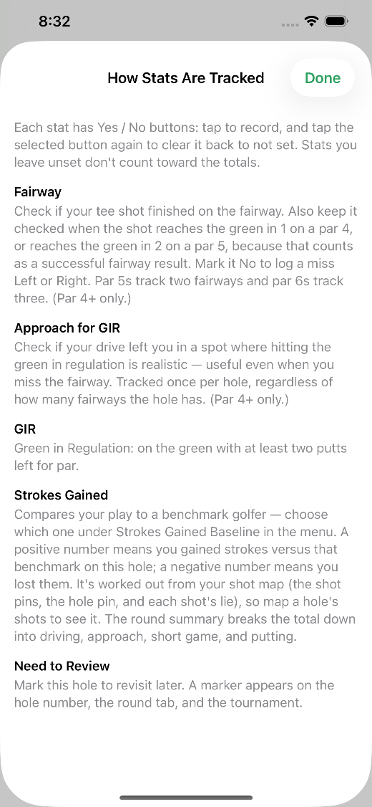

## The shot map

The shot map is optional but powerful: tag where each shot lands on a satellite
view and the app measures your distances, infers your score, and unlocks strokes
gained. Open it from the **Shot Map** row on any hole.

### Tag shots, the flag & auto score

Tap **Shot Map** on a hole to plot your shots on a satellite view. The bottom
bar is where the action is:

- **Tag Shot** drops a pin at your current GPS location for each stroke.
- **Set Flag** / **Move Flag** places the pin at the hole.
- **Auto Score** fills the hole's score and putts from the pins you've dropped.

Turn on **plays-like distance** (the ruler, top right) to adjust yardages for
elevation and wind. Tap any pin to edit its club, lie, or slope — or to record a
**penalty** or a **relief** drop.

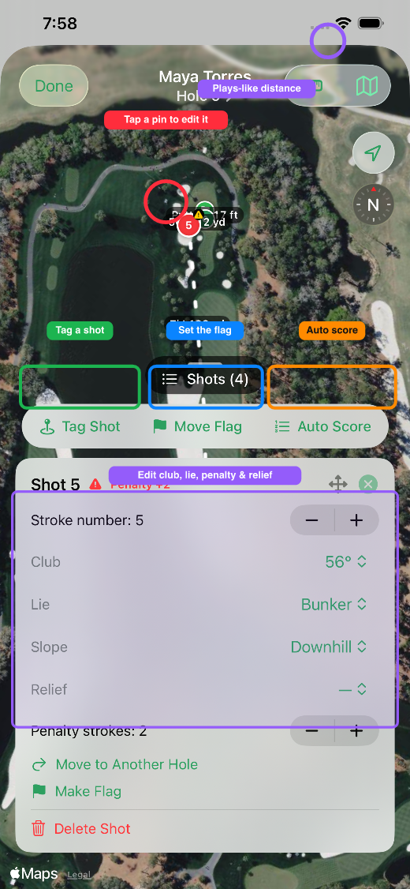

### Tap to tag vs. center crosshair

There are two ways to drop a pin, switchable from the **map options** menu
(top-right):

- **Tap to tag** (the default) — just tap the spot on the map.
- **Center crosshair** — a fixed crosshair stays at the screen centre; pan the
  map to aim it precisely, then tap **Tag Shot Here**. Easier for exact
  placement, especially when zoomed in.

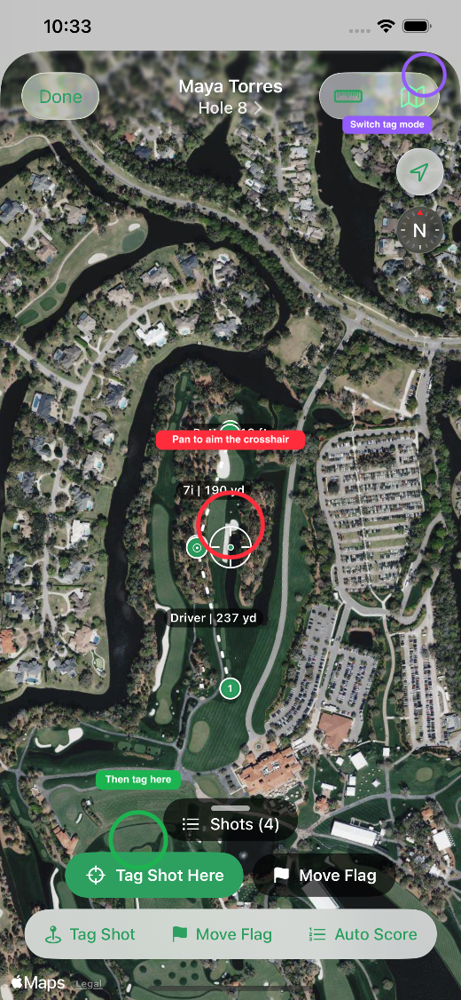

### Plays-like distance

Uphill shots play longer and downhill shots play shorter. Turn on **plays-like
distance** (the ruler in the top-right of the shot map) to adjust each yardage
for **elevation** and **wind**. The badge on a shot then shows the adjusted
distance with how much was added or removed. The first time you enable it, the
app asks permission to look up elevation and use the round's wind.

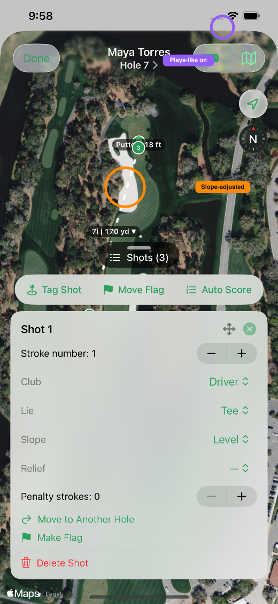

### Edit a shot: penalties & relief

Tap any shot pin to open its editor. Set the **club**, **lie**, and **slope** —
these feed your club distances and strokes gained.

**Penalties and relief.** For a ball that's out of bounds or in a water hazard,
tag the shot **where the ball finished**, then on your **next** shot — where you
drop or play from — pick a **Relief** type. Choosing a relief option **adds the
penalty stroke for you automatically**, so you don't need to touch the penalty
count. The separate **Penalty strokes** stepper is still there for any other
penalty you want to add by hand.

You can also move the shot, renumber it, send it to another hole, turn it into
the flag, or delete it.

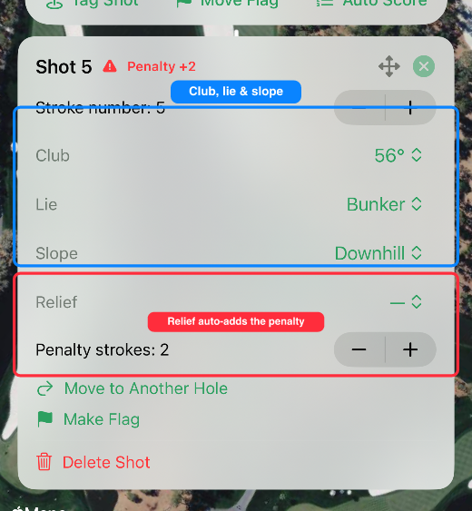

## Scoring from your Apple Watch

With your iPhone nearby, connect a round to your Apple Watch (the round's
**•••** menu → **Connect to Apple Watch**) and score from your wrist. The main
screen is a 2×2 grid:

- **Tag** — drop a GPS shot.
- **Voice** — dictate a shot ("seven iron from the rough").
- **Set Flag** — drop the flag pin at the hole.
- **Score** — save the hole and jump to the next one.

Swipe left or right to change holes, and the running total sits just below the
grid.

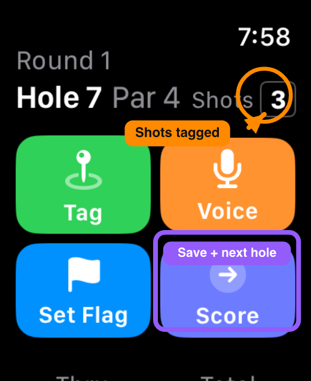

## Reviewing a round

Once you've scored some holes, review the round — a running scorecard while you
play, and full stats, charts, and AI coaching when it's done.

### The scorecard

While a round is in progress, tap **Scorecard** at the bottom for a running table
of every hole — yardage, par, your score (over/under par coloured), putts,
fairways, GIR, and strokes gained — with running totals.

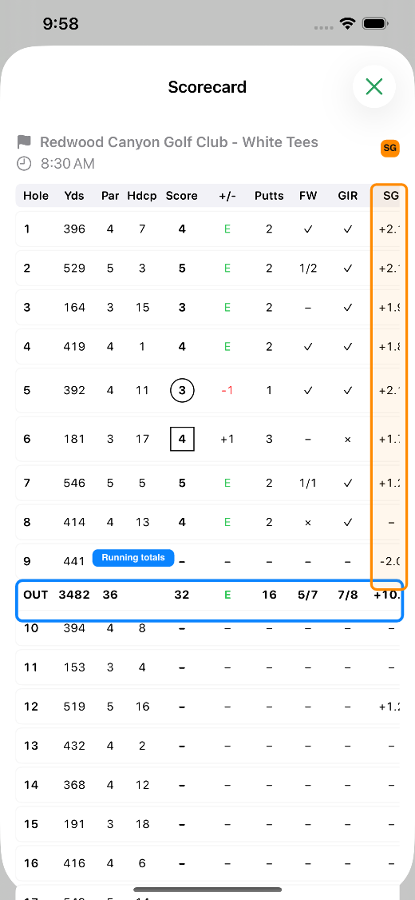

### Round summary

When a round is complete, tap **Round Summary** for the full picture: total score
to par, the stat cards (fairways, approach, GIR, putts, penalties, up-and-down),
weather, strokes gained by category, and the scorecard — all in one scrollable
sheet.

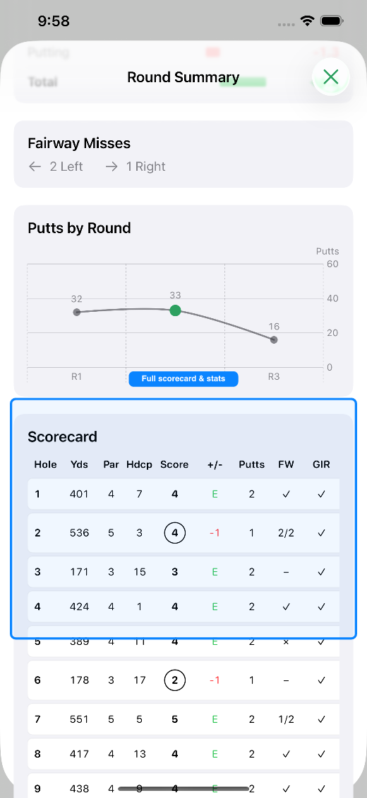

### Scoring & putting breakdown

Scroll the summary to see your **scoring** and **putting** broken down as donut
charts — birdies/pars/bogeys and one-/two-/three-putts — plus a trend of putts
across the tournament's rounds.

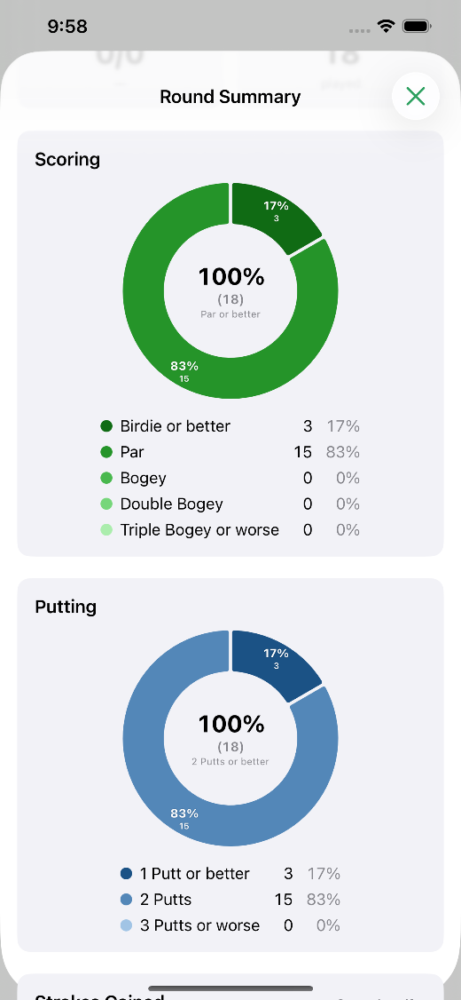

### AI round analysis

Tap **Ask AI** on a finished round for a short coaching summary: what went well,
where you're leaking strokes, and a practice focus. It runs on-device when your
iPhone supports Apple Intelligence; otherwise use **Ask Another AI** to copy the
prompt into ChatGPT or Claude.

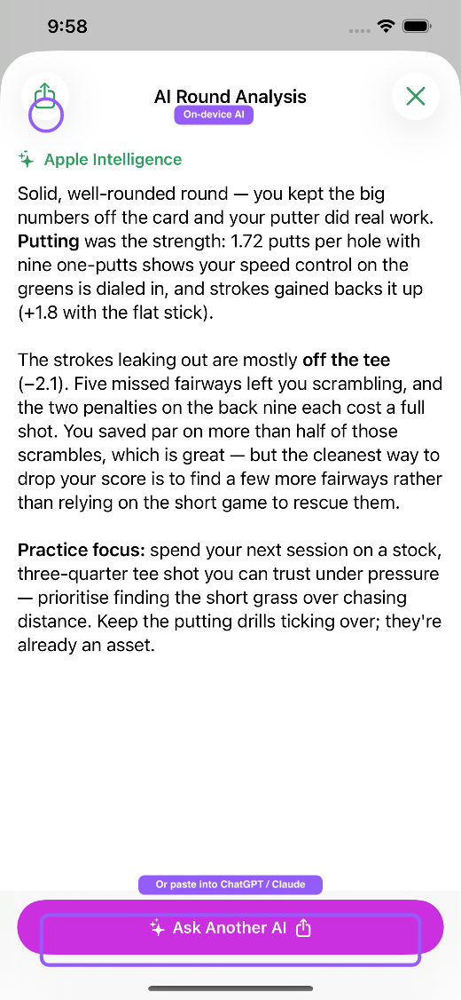

## Sharing a round

Share a round live so friends can follow your scores in real time, export it as
a PDF or spreadsheet, or send it to another Golf Stats user.

### Share live scores

To share your scores live, open the **share** button and tap **Share Live
Scores**. The app gives you a short **share code** and a QR code — send either to
anyone you want following along. Your scores update on their phone in real time
as you play. Tap **Stop Sharing** when you're done.

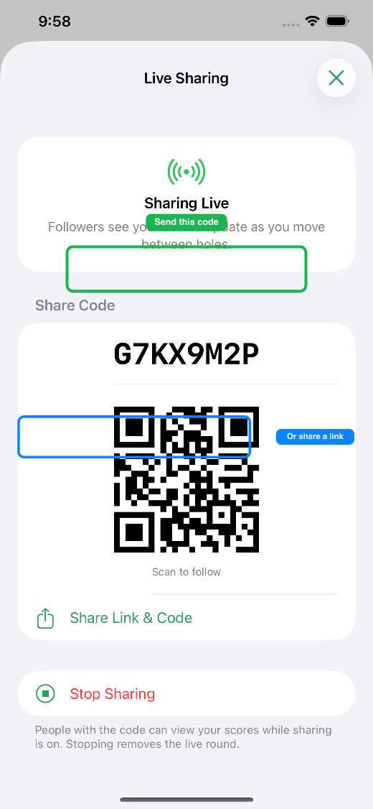

### Follow a live round

To start following someone's live round, tap the **live** icon on the
tournament list. Then **type the 8-character share code** they sent you, **scan
their QR code**, or open the link they shared — tap **Follow Round** and their
scorecard appears, updating live as they play. You can also choose to be
notified as they finish holes.

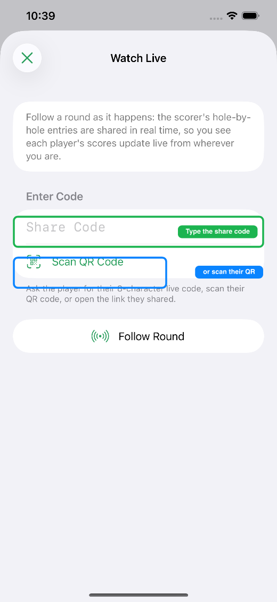

### Follow several players

Following more than one player? The viewer adds a **tab bar** along the bottom —
one tab per player — so you can flick between their live scorecards. Tap
**•••** → **Follow Round** to add another, or open the player you want and tap
**•••** → **Stop Following** to remove them.

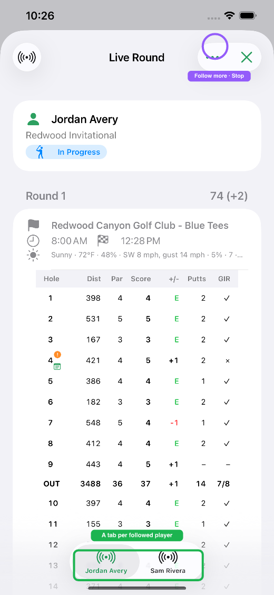

### Export or send a round

Tap the **share** button for four options:

- **Share Live Scores** — start live sharing (see above).
- **Export as PDF** — a scorecard PDF, including your shot-map images.
- **Export as Spreadsheet** — an Excel file of the scorecard.
- **Share with Golf Stats Users** — a file another Golf Stats user can import to
  get your full round, holes and shot maps included.

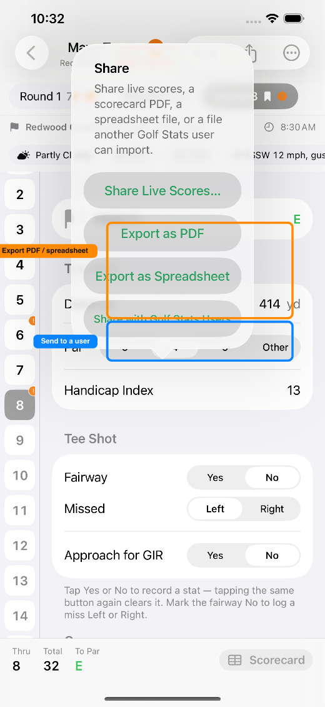
